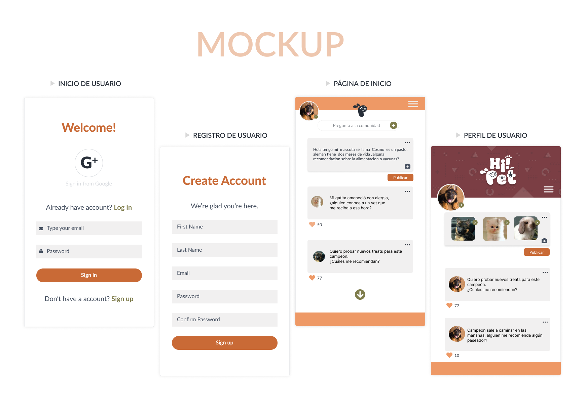
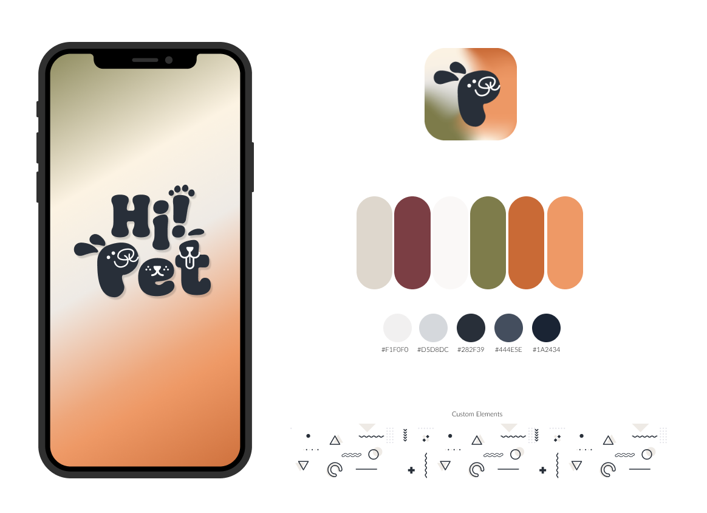
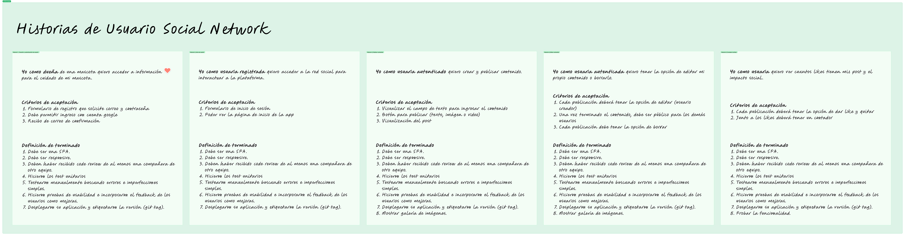
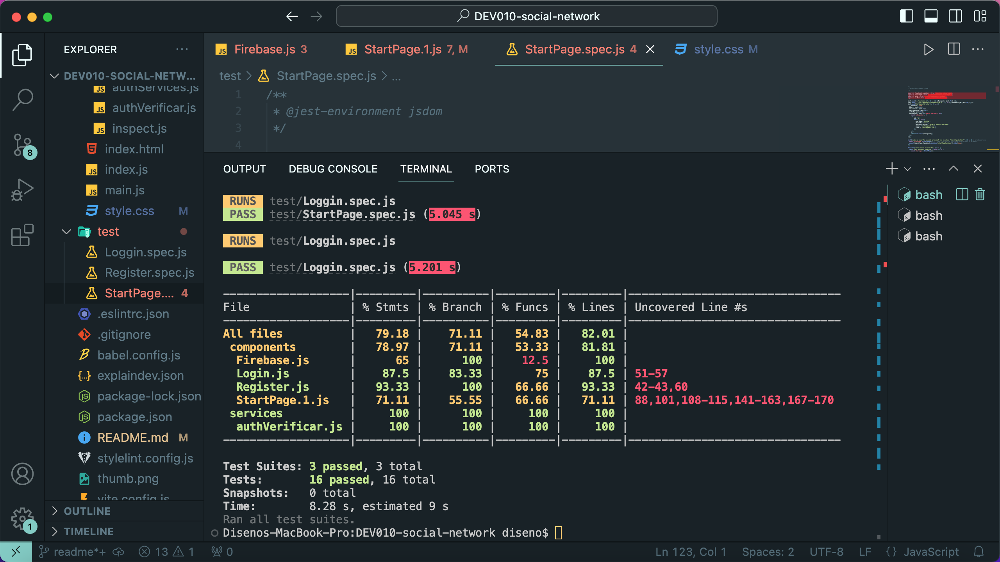

# Hi! Pet

## Tu Comunidad Social para Amantes de Mascotas

* [1. Conócenos](#1-conócenos)
* [2. Desarrollo de Hi! Pet](#2-desarrollo-de-Hi!-Pet)
* [3. Pruebas Unitarias y Calidad del Código](#3-pruebas-unitarias-y-calidad-del-código)
* [4. Mejoras Futuras](#4-mejoras-futuras)

## 1. Conócenos

¡Bienvenido a Hi! Pet, la red social dedicada a todos los amantes de las mascotas! Hi! Pet es una Single Page Application (SPA) diseñada para conectar a dueños de mascotas y brindarles un espacio interactivo donde pueden compartir, aprender y crecer juntos en su amor por los animales.

¡Únete a Hi! Pet hoy y forma parte de una comunidad vibrante de amantes de mascotas!
- [Hi! Pet]()

### Características Destacadas

* **Publicaciones y Tips:** Comparte tus experiencias, consejos útiles y momentos adorables con la comunidad PetConnect.
* **Búsqueda de Lugares:** Encuentra fácilmente veterinarios, tiendas de mascotas y parques cercanos para llevar a tus compañeros peludos.
* **Interacción Social:** Haz clic en el botón de "Me gusta" para mostrar aprecio por las publicaciones que te encantan y deja comentarios para conectar con otros dueños de mascotas.

## 2. Desarrollo de Hi! Pet

### Prototipos y Diseño

Hi! Pet fue concebida a través de un emocionante viaje de diseño iterativo, marcado por la creación cuidadosa de prototipos. Este proceso aseguró una experiencia de usuario que no solo es intuitiva, sino también profundamente atractiva. Nuestra paleta de colores, inspirada en la vitalidad y diversidad de las mascotas y del bosque otoñal, crea un entorno visualmente agradable y acogedor.  

  

### Diseño Responsivo y Adaptativo

Manteniendo nuestra paleta de colores que celebra la vitalidad animal, diseñamos Hi! Pet con un enfoque "mobile first". Esta estrategia nos permitió priorizar la experiencia en dispositivos móviles, asegurando un acceso sin fricciones y funcionalidad óptima en cualquier lugar. Luego, de manera progresiva, adaptamos la interfaz para aprovechar las características específicas de pantallas más grandes en entornos desktop.  

### Historias de Usuario  

* **Acceso sin Fricciones en Móviles:** Como usuario, quiero tener una experiencia fluida al acceder a Hi! Pet desde mi dispositivo móvil, asegurando que todas las funciones sean accesibles y fáciles de usar.
* **Registro sin Obstáculos:** Como usuario, quiero poder registrarme con facilidad y rapidez para comenzar a explorar la comunidad.
* **Búsqueda Eficiente:** Como dueño de mascotas, quiero poder encontrar rápidamente lugares relevantes para cuidar de mis animales.
* **Interacción Social Intuitiva:** Como miembro de la comunidad, quiero expresar mi aprecio por las publicaciones de otros con un simple clic.

## 3. Pruebas Unitarias y Calidad del Código

Cada componente de Hi! Pet está respaldado por rigurosas pruebas unitarias para garantizar la estabilidad y la calidad del código. Nuestro compromiso con la excelencia técnica se refleja en un proceso de desarrollo centrado en la escalabilidad (capacidad de la aplicación para crecer y manejar un mayor volumen de tráfico y datos sin que esto afecte negativamente su rendimiento).  

## 4. Mejoras Futuras

Estamos comprometidos con el crecimiento continuo de PetConnect y planeamos implementar mejoras emocionantes en el futuro, como:

* **Agregar Funcionalidades Avanzadas de Búsqueda:** Implementar search y mejorar la precisión y la amplitud de la búsqueda para proporcionar información aún más relevante.
* **Integración de Imágenes:** Permitir a los usuarios compartir momentos aún más memorables de sus mascotas a través de imágenes.
* **Permitir buscar usuarios, agregar y eliminar "amigos"**
* **Permitir definir la privacidad de los posts (público o solamente para amigos)**
* **Permitir ver su muro de cualquier usuario "no-amigo" (solamente los posts públicos)**
* **Permitir comentar o responder una publicación**
* **Permitir editar perfil**

### Este proyecto fue creado por las desarrolladoras:
[_Ivonne Conde_](https://github.com/IvonneConde), [_Angie Jazmin Montenegro_](https://github.com/jazminmontenegro), [_Cynthia C. Mtz._](https://github.com/CynCaro) en proceso con [Laboratoria](https://github.com/Laboratoria).
